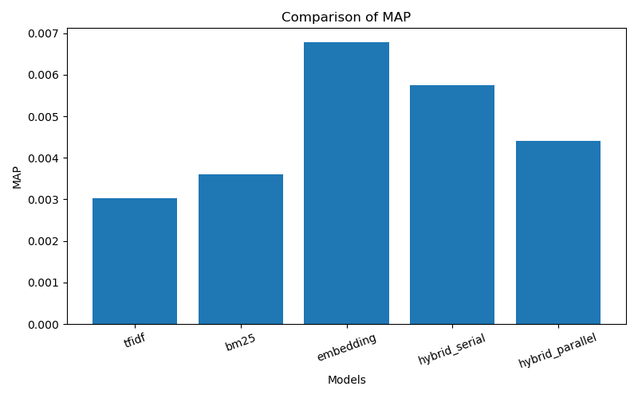
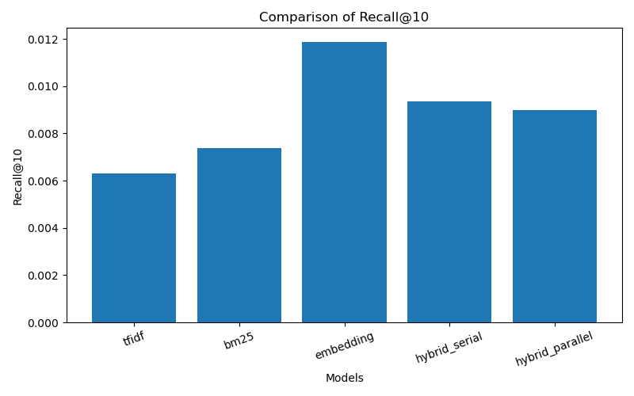
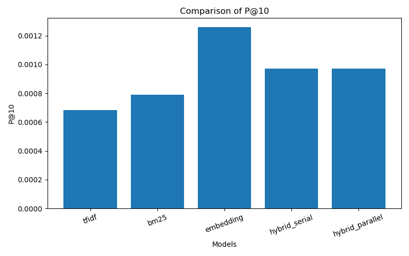
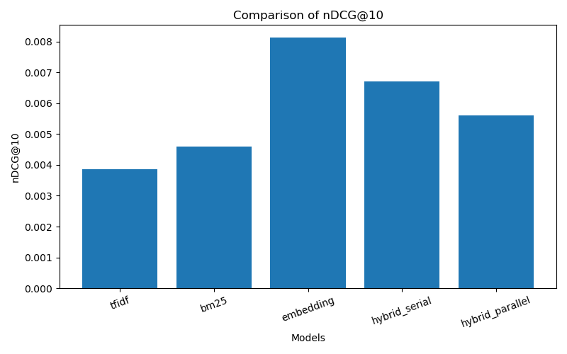

# Information Retrieval System 2026

A custom search engine built in Python using Service Oriented Architecture (SOA).

## Project Structure

```
IR/
├── services/
│   ├── preprocessing_service/     # Data cleaning, stemming, lemmatization
│   ├── indexing_service/          # Inverted index construction
│   ├── retrieval_service/         # TF-IDF, BM25, Embeddings, Hybrid
│   ├── query_service/             # Query processing & refinement
│   ├── ranking_evaluation_service/ # Ranking, MAP, nDCG, Precision
│   └── api_gateway/               # REST API entry point (FastAPI)
├── ui/                            # Streamlit web interface
├── data/
│   ├── dataset1/                  # First IR dataset
│   └── dataset2/                  # Second IR dataset
├── notebooks/                     # Jupyter notebooks for experiments
├── shared/                        # Shared utilities across services
├── tests/                         # Unit tests per service
├── requirements.txt
└── README.md
```

## Setup

```bash
# 1. Create virtual environment
python -m venv ir_env
ir_env\Scripts\activate      # Windows
source ir_env/bin/activate   # Linux/Mac

# 2. Install dependencies
pip install -r requirements.txt

# 3. Download spaCy model
python -m spacy download en_core_web_sm

# 4. Download NLTK data
python -c "import nltk; nltk.download('punkt'); nltk.download('punkt_tab'); nltk.download('stopwords'); nltk.download('wordnet'); nltk.download('omw-1.4'); nltk.download('averaged_perceptron_tagger'); nltk.download('averaged_perceptron_tagger_eng'); nltk.download('maxent_ne_chunker'); nltk.download('maxent_ne_chunker_tab'); nltk.download('words'); nltk.download('vader_lexicon')"
```

## Pipeline — Run in Order

```bash
# Step 1: Download datasets (MS MARCO + BEIR/NQ)
python data/download_datasets.py

# Alternative direct downloader if needed
python data/download_direct.py

# Step 2: Preprocessing — produces files in data/
python -m services.preprocessing_service.run_preprocessing
# Output:
#   data/processed_dataset1.jsonl   ← tokens for indexing
#   data/processed_dataset2.jsonl
#   data/queries_dataset1.jsonl     ← queries with tokens
#   data/queries_dataset2.jsonl
#   data/qrels_dataset1.txt         ← relevance judgments (TREC format)
#   data/qrels_dataset2.txt
#   data/empty_docs_dataset1.txt    ← doc_ids with 0 tokens (skipped by indexing)
#   data/empty_docs_dataset2.txt

# Step 3: Indexing — builds Inverted Index for both datasets
python -m services.indexing_service.run_indexing
# Output:
#   data/dataset1/index.pkl
#   data/dataset2/index.pkl

# Step 3b: Build library-based TF-IDF & BM25 models (sklearn + rank_bm25)
python -m services.retrieval_service.build_lexical_models
# Output:
#   data/dataset1/tfidf_model.pkl
#   data/dataset1/bm25_model.pkl
#   data/dataset2/tfidf_model.pkl
#   data/dataset2/bm25_model.pkl
# Options: --dataset dataset1 | --force | --sample 5000

# Step 4: (Optional) Generate embeddings for semantic/hybrid search
python -m services.retrieval_service.run_embeddings

# Step 5: Start API Gateway
uvicorn services.api_gateway.main:app --reload --port 8000

# Step 5: Build document lookup for displaying original documents
python -m services.document_store_service.build_document_lookup

# Output:
#   data/dataset1/document_lookup.pkl
#   data/dataset2/document_lookup.pkl

# Step 6: Start UI
streamlit run ui/app.py


```

## Document Store / Original Document Lookup

To display the original document text in the final search results, a document lookup file is generated for each dataset.

The retrieval models return only `doc_id` and `score`.  
After ranking, the API uses the `doc_id` to fetch the original document text from:

````text
data/dataset1/document_lookup.pkl
data/dataset2/document_lookup.pkl

## Indexing Results

The indexing step was completed successfully for both datasets.

```text
Dataset 1:
Indexed documents: 499,992
Vocabulary size: 232,982
Average document length: 28.90
Skipped empty docs: 8

Dataset 2:
Indexed documents: 499,025
Vocabulary size: 318,978
Average document length: 41.91
Skipped empty docs: 975
```

The generated indexes are saved locally as:

```text
data/dataset1/index.pkl
data/dataset2/index.pkl
```

These files are not committed to GitHub because they are large.

To regenerate them locally, run:

```bash
python -m services.indexing_service.run_indexing
```

## Verify Indexes

To verify that the indexes were generated:

```bash
python -c "from pathlib import Path; print('dataset1 index:', Path('data/dataset1/index.pkl').exists()); print('dataset2 index:', Path('data/dataset2/index.pkl').exists())"
```

Expected output:

```text
dataset1 index: True
dataset2 index: True
```

To verify that the indexes can be loaded:

```bash
python -c "from services.indexing_service.inverted_index import InvertedIndex; idx=InvertedIndex(); idx.load('data/dataset1/index.pkl'); print('Loaded dataset1 index OK')"

python -c "from services.indexing_service.inverted_index import InvertedIndex; idx=InvertedIndex(); idx.load('data/dataset2/index.pkl'); print('Loaded dataset2 index OK')"
```

## Verify Lexical Models (TF-IDF + BM25)

```bash
python -c "from pathlib import Path; print(Path('data/dataset1/tfidf_model.pkl').exists()); print(Path('data/dataset1/bm25_model.pkl').exists()); print(Path('data/dataset2/tfidf_model.pkl').exists()); print(Path('data/dataset2/bm25_model.pkl').exists())"

python -c "from services.retrieval_service.tfidf_retrieval import retrieve_tfidf; print('TF-IDF import OK')"

python -c "from services.retrieval_service.bm25_retrieval import retrieve_bm25; print('BM25 import OK')"
```

TF-IDF uses **scikit-learn `TfidfVectorizer`** + `cosine_similarity`.
BM25 uses **rank_bm25 `BM25Okapi`**. Models are built once via `build_lexical_models` and loaded from cache at query time (not rebuilt on first query).

## Working Retrieval Models

The following models were tested from the Streamlit UI after building the indexes:

| Model           | Dataset 1       | Dataset 2       | Status                  |
| --------------- | --------------- | --------------- | ----------------------- |
| BM25            | Working         | Working         | Tested                  |
| TF-IDF          | Working         | Working         | Tested                  |
| Embedding       | Not ready       | Not ready       | Requires embeddings.pkl |
| Hybrid Serial   | Partially ready | Partially ready | Requires embeddings.pkl |
| Hybrid Parallel | Not ready       | Not ready       | Requires embeddings.pkl |

BM25 and TF-IDF were tested using the FastAPI backend and Streamlit UI.

BM25 parameters can be changed from the UI:

```text
k1: controls term frequency saturation
b: controls document length normalization
```

Tested BM25 values:

```text
Default:
k1 = 1.5
b = 0.75

Test:
k1 = 2.5
b = 0.5
```

## Quick test (preprocessing)

```bash
python test_preprocessing.py
```

## Services

| Service              | Port | Responsibility                        |
| -------------------- | ---- | ------------------------------------- |
| API Gateway          | 8000 | Routes requests to services           |
| Preprocessing        | -    | Tokenization, stemming, lemmatization |
| Indexing             | -    | Inverted index for fast retrieval     |
| Retrieval            | -    | TF-IDF, BM25, Embeddings, Hybrid      |
| Query                | -    | Query processing & refinement         |
| Ranking & Evaluation | -    | Ranking results, MAP/nDCG metrics     |

## Datasets

- **Dataset 1**: `msmarco-passage/dev`
- **Dataset 2**: `beir/nq`

Requirements: 200K+ documents, with queries and qrels.

Large dataset files are not committed to GitHub.
They should be downloaded locally using:

```bash
python data/download_direct.py
```

Expected local dataset structure:

```text
data/
├── dataset1/
│   ├── documents.jsonl
│   ├── queries.jsonl
│   └── qrels.jsonl
│
├── dataset2/
│   ├── documents.jsonl
│   ├── queries.jsonl
│   └── qrels.jsonl
```

## Person 2 Completion Summary

Person 2 completed the following tasks:

- Created `services/indexing_service/run_indexing.py`
- Built an inverted index for `dataset1`
- Built an inverted index for `dataset2`
- Saved indexes locally to:
  - `data/dataset1/index.pkl`
  - `data/dataset2/index.pkl`
- Verified that both indexes load correctly
- Tested `TF-IDF` successfully
- Tested `BM25` successfully
- Tested BM25 search from the Streamlit UI on both datasets
- Tested TF-IDF search from the Streamlit UI on both datasets
- Verified that BM25 parameters `k1` and `b` can be changed from the UI

## Person 3 Completion Summary

Person 3 completed the Embeddings, Vector Store, and Semantic Search part of the project.

### Completed Tasks

- Selected an embedding model:
  - `sentence-transformers/all-MiniLM-L6-v2`

- Created the embeddings runner:

```text
services/retrieval_service/run_embeddings.py
```

- Generated document embeddings for both datasets.

- Built FAISS vector indexes for semantic search.

- Updated embedding retrieval logic in:

```text
services/retrieval_service/embedding_retrieval.py
```

- Added a test script for embedding search:

```text
services/retrieval_service/test_embedding_search.py
```

- Integrated embedding retrieval with the API Gateway by supporting:

```text
model = embedding
```

- Tested embedding retrieval from:
  - command line
  - FastAPI
  - Streamlit UI

---

### Generated Files

Dataset 1:

```text
data/dataset1/embeddings.pkl
data/dataset1/embedding_metadata.pkl
data/dataset1/faiss.index
```

Dataset 2:

```text
data/dataset2/embeddings.pkl
data/dataset2/embedding_metadata.pkl
data/dataset2/faiss.index
```

These generated files are not committed to GitHub because they can be large and should be regenerated locally.

---

### Embedding Generation Command

```bash
python -m services.retrieval_service.run_embeddings
```

<<<<<<< HEAD
---

### Embedding Search Test

```bash
python -m services.retrieval_service.test_embedding_search
```

---

### Current Note

During the current test run, embeddings were generated using:

```python
SAMPLE_SIZE = 10000
```

This means the semantic search was tested on the first 10,000 documents from each dataset to reduce runtime and memory usage.

To generate embeddings for the full datasets, remove or increase `SAMPLE_SIZE` in:

```text
services/retrieval_service/run_embeddings.py
```

---

## Next Step for Person 4

Person 4 is responsible for Hybrid Retrieval, Query Refinement, and Ranking.

### Remaining Tasks

- Implement Serial Hybrid Retrieval.
- Implement Parallel Hybrid Retrieval.
- Implement Fusion Methods such as Reciprocal Rank Fusion (RRF).
- Implement Query Refinement techniques.
- Standardize retrieval output format across all models.
- Compare BM25, TF-IDF, fand Embedding retrieval results.
- Build a unified ranking layer.
- Document Hybrid Retrieval and Query Refinement components.

### Expected Deliverables

```text
services/retrieval_service/hybrid_retrieval.py
services/retrieval_service/fusion_service.py
services/query_service/query_processor.py
services/ranking_service/ranking_service.py
```
## Person 4 Completion Summary

Person 4 completed the Hybrid Retrieval, Query Refinement, Ranking, and Evaluation integration layer of the Information Retrieval System.

### Completed Tasks
🔹 1. Hybrid Retrieval (Serial + Parallel)

Implemented two hybrid strategies combining multiple retrieval models:

✔ Serial Hybrid Retrieval
Step 1: BM25 is used to retrieve initial candidate documents.
Step 2: Embedding-based retrieval is applied on candidate set.
Step 3: Final reranking based on semantic similarity filtering.
BM25 → Candidate Selection → Embedding Re-ranking → Final Results
✔ Parallel Hybrid Retrieval
Runs multiple retrieval models in parallel:
BM25
TF-IDF
Embedding Search
Combines results using fusion techniques.
BM25 + TF-IDF + Embedding → Fusion Layer → Final Ranking
### 2. Fusion Methods

Implemented ranking fusion techniques to combine multiple retrieval outputs:

✔ Reciprocal Rank Fusion (RRF)
Combines rankings from multiple models
Robust to score scale differences
Final Score = Σ (1 / (k + rank))
✔ Linear Fusion (Weighted)
Combines normalized scores using weights
### 3. Query Refinement Module

Implemented a unified query processing pipeline in:

services/query_service/query_processor.py
✔ Features:
Token cleaning and normalization
Stopword removal
Stemming / lemmatization
Synonym expansion (optional)
Spell correction (optional)
🔥 Pseudo Relevance Feedback (PRF)
✔ PRF (Pseudo Relevance Feedback)
Retrieves top initial results
Extracts expansion terms from top documents
Expands original query
Original Query → Initial Retrieval → Expansion Terms → Expanded Query → Final Retrieval
✔ Behavior:
PRF is optional (use_prf checkbox in UI)
Works on top of any retrieval model
Only modifies query input, not retrieval model
### 4. Ranking Layer Standardization

Implemented a unified ranking format across all retrieval models:

✔ Standard Output Format:
[
  {
    "doc_id": str,
    "score": float,
    "rank": int,
    "snippet": str
  }
]
✔ Responsibilities:
Ensures consistency across BM25, TF-IDF, Embeddings, Hybrid
Used by API Gateway and Streamlit UI
### 5. Evaluation & Model Comparison

Implemented ranking evaluation service:

services/ranking_evaluation_service/comparison_service.py
✔ Metrics Supported:
MAP (Mean Average Precision)
Precision@10
Recall
nDCG@10
✔ Functionality:
Compare multiple retrieval models:
BM25
TF-IDF
Embedding
Hybrid Serial
Hybrid Parallel
Uses ir_measures library for evaluation
✔ Evaluation Input Format:
runs = {
    "bm25": DataFrame(doc_id, score),
    "tfidf": DataFrame(doc_id, score),
    "embedding": DataFrame(doc_id, score)
}
### 6. API Gateway Integration

Extended FastAPI /search endpoint to support:

✔ PRF + Query Refinement Pipeline:
Query → Refinement → (PRF Expansion) → Retrieval → Ranking → Response
✔ Added Response Fields:
{
  "query": "...",
  "corrected_query": "...",
  "expanded_query": "...",
  "model_used": "...",
  "results": []
}
### 7. UI Integration (Streamlit)

Updated Streamlit interface to support:

✔ Features:
Model selection (BM25, TF-IDF, Embedding, Hybrid)
PRF toggle checkbox
Query correction display
Expanded query display
Ranking table view
Debug mode for API response
### 8. Debugging & System Fixes

During integration, the following issues were resolved:

Fixed missing parameters in hybrid retrieval functions
Fixed FAISS embedding dataset parameter mismatch
Fixed PRF integration with query pipeline
Fixed API Gateway crash (500 errors)
Fixed ranking output consistency issues
Fixed Streamlit duplicate button key errors
Added safe JSON parsing for API responses
### Final System Behavior

The final integrated system supports:

✔ Multi-Model Retrieval
BM25
TF-IDF
Embeddings
Hybrid Serial
Hybrid Parallel
✔ Query Enhancement
Spell correction
Synonym expansion
Pseudo Relevance Feedback (PRF)
✔ Hybrid Ranking
Serial re-ranking pipeline
Parallel fusion (RRF / Linear)
✔ Evaluation
Cross-model comparison using IR metrics
### Final Deliverables
services/retrieval_service/hybrid_retrieval.py
services/retrieval_service/fusion_service.py
services/query_service/query_processor.py
services/ranking_evaluation_service/comparison_service.py
services/api_gateway/main.py (updated search pipeline)
ui/app.py (Streamlit interface)
=======
<<<<<<< HEAD
Note: Embedding generation for 500,000 documents per dataset can take a long time and may require significant memory.
## Evaluation

The retrieval models were evaluated using standard Information Retrieval metrics.

### Metrics

- MAP
- Recall@10
- Precision@10
- nDCG@10

### Evaluation Dataset

- Dataset: MSMARCO Passage
- Evaluated queries: 2,781

### Results

| Model | MAP | Recall@10 | P@10 | nDCG@10 |
|-------|------|------------|------|---------|
| TF-IDF | 0.003032 | 0.006293 | 0.000683 | 0.003868 |
| BM25 | 0.003613 | 0.007371 | 0.000791 | 0.004592 |
| Embedding | 0.006783 | 0.011866 | 0.001259 | 0.008132 |
| Hybrid Serial | 0.005747 | 0.009349 | 0.000971 | 0.006700 |
| Hybrid Parallel | 0.004407 | 0.008990 | 0.000971 | 0.005613 |

### Key Findings

- Embedding retrieval achieved the best MAP and nDCG@10 scores.
- BM25 outperformed TF-IDF across all metrics.
- Hybrid retrieval improved recall compared with lexical approaches.

### Run Evaluation

```bash
python -m services.ranking_evaluation_service.evaluator
```

### Generate Charts

```bash
python reports/generate_charts.py
```
## Team

| Member | Responsibility |
|--------|---------------|
| Person 1 | Core Architecture, Preprocessing Service |
| Person 2 | Indexing Service, TF-IDF, BM25 |
| Person 3 | Embeddings, Hybrid Representation |
| Person 4 | Query Processing & Refinement |
| Person 5 | Evaluation, UI, Additional Feature |


## Evaluation Charts

### MAP



### Recall@10



### Precision@10



### nDCG@10



````
>>>>>>> a53e584173b80933109d55f30e06845f6710664a
